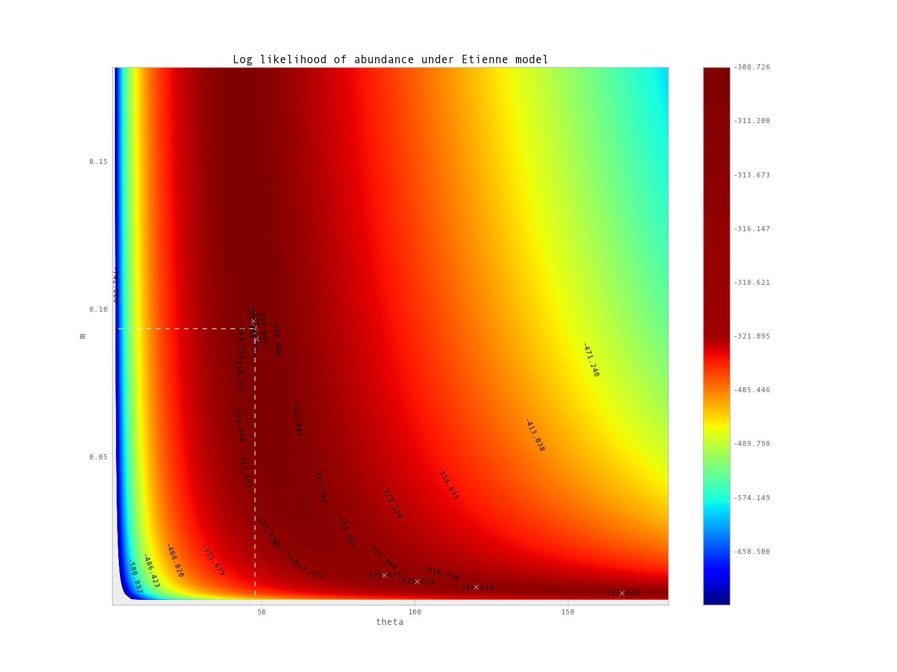

.. moduleauthor:: Francois Serra
.. currentmodule:: ecolopy

Tutorial
********

.. contents::

Just after counting species abundances in an ecosystem
======================================================

Load Abundance
--------------

Abundance is a class, and derived objects represent simply a distribution of species abundance , with associated function in order to calculate descriptive statistics or to fit it to evolutionary models.

The data needed to create this object consists on a list of values corresponding to the abundance of each species. We can either give to Abundance a python list of values:
::

  Abundance ([1, 4, 4, 12, 54, 68, 32, 15])

or the path to a file containing those values:
::

  Abundance ('whatever_path/mydata.txt')

mydata.txt would contain the same list of values, one per row:

::

  1
  4
  4
  12
  54
  68
  32
  15

In the next step we are going to create an object :func:`ecolopy.abundance.Abundance` that will represent the distribution of abundance of the well known/studied BCI dataset.

We are going to load this object under the name 'abd':

::

  from ecolopy import Abundance
  abd = Abundance ('bci_full.txt')

Quick descriptive statistics
----------------------------

In order to see quickly how does this abundance looks like, we can use the print command:

::

  print abd

  #  Abundance (object)
  #      Number of individuals (J) : 21457
  #      Number of species (S)     : 225
  #      Shannon entropy (shannon) : 4.2704
  #      Metacommunity size (j_tot): 64371
  #      Models computed           : 
  #      Current model             : None
  #      Theta                     : None
  #      I                         : None
  #      m                         : None
  #      lnL                       : None

With:

* Number of individuals correspond to the total of the given community
* Number of species should correspond to the number of element in your input list, or to the number of line in your input file
* Shannon entropy [Shannon1948]_ is computed according to:

.. math::
  :nowrap:

  \begin{eqnarray}
    H(X) = \sum_{0\le i\le n} p(x_i) * log (p(x_i))
  \end{eqnarray}

X being the number of individuals for each species and n the number of species.

* Metacommunity size: correspond to 3 times the community size if not defined by user, we could have write to fix it at a given value instead of default:

::

  abd = Abundance ('bci_full.txt', j_tot=10000000)

* Models computed: :func:`ecolopy.abundance.Abundance` can be associated to an Ecological model, the user
  need first to compute them.
* Current Model: once computed, we can associate our abundance to a given model
* theta: given by the model
* I: given by the model
* m: given by the model

RSA curve
^^^^^^^^^

An other way to see quickly how out abundance looks-like is to print relative species abundance curve (RSA) with :func:`ecolopy.abundance.Abundance.rsa_ascii`:
::
  print abd.rsa_ascii(pch='o', width=90, height=40)
  """
  (%) Relative
  Abundances

  8.0021 +o
         | 
         | oo
         |   o
  2.6181 +    ooo
         |       o
         |        ooo
  1.0319 +           oo
         |             oo
         |               o
         |                o
         |                 oooo
  0.4067 +                     ooo
         |                        oooo
         |                            oooo
         |                                oo
         |                                  ooo
  0.1603 +                                     oooo
         |                                         ooooo
         |                                              ooooo
         |                                                   o
         |                                                    oooo
  0.0632 +                                                        ooooo
         |                                                             ooo
         |                                                                oo
         |                                                                  oo
         |                                                                    
  0.0249 +                                                                    oooo
         |                                                                        oo
         |                                                                          ooo
         |                                                                             ooooo
         |                                                                                  oooooooo
   1/inf +----+----+----+----+----+----+----+----+----+----+----+----+----+----+----+----+----+----+
         0    12   25   37   50   62   75   87   100  112  125  137  150  162  175  187  200  212  222
  
                                                Species rank                                       
  """

Fit to ecological model
=======================

Once our distribution of abundances loaded into an Abundance object, EcoloPy proposes a set of ecological models that we can try to fit to our data.

Ewens model
-----------

As described by Hubbell [Hubbell2001]_ 'Ewens model' uses Ewens sampling formula [Ewens1972]_ in order to explain the distribution and abundance of species.

This model assumes that:

.. math::
  :nowrap:

  \begin{eqnarray}
    I  = \frac{m}{(1 - m) * (J - 1)}
  \end{eqnarray}

we just have to type:

::

  abd.ewens_optimal_params()

this step is usually very fast.

to load this model as our current model, just type:

::

  abd.set_current_model('ewens')

  print abd

  #  Abundance (object)
  #      Number of individuals (J) : 21457
  #      Number of species (S)     : 225
  #      Shannon entropy (shannon) : 4.2704
  #      Metacommunity size (j_tot): 64371
  #      Models computed           : ewens
  #      Current model             : ewens
  #      Theta                     : 34.962254203932339
  #      I                         : 17.494565308269266
  #      m                         : 0.00081470508933989701
  #      lnL                       : 318.84864864917472

Etienne model
^^^^^^^^^^^^^

Now we can run an other model like the one proposed by Etienne [Etienne2005]_, just type

::

  abd.etienne_optimal_params()
  abd.set_current_model ('etienne')
  # Getting K(D,A) according to Etienne 2005 formula:
  #   Getting some stirling numbers...
  #     1000 of 1717.0, size: 3145976
  #   Computing K(D,A) at species 108 out of 108

  print abd
  # Abundance (object)
  #     Number of individuals (J) : 21457
  #     Number of species (S)     : 225
  #     Shannon entropy (shannon) : 4.2704
  #     Metacommunity size (j_tot): 64371
  #     Models computed           : ewens, etienne
  #     Current model             : etienne
  #     Theta                     : 47.6743190606
  #     I                         : 2211.0866293821641
  #     m                         : 0.0934245377983
  #     lnL                       : 308.72540670815931

Best optimization strategy for Etienne model
^^^^^^^^^^^^^^^^^^^^^^^^^^^^^^^^^^^^^^^^^^^^

:func:`ecolopy.abundance.Abundance.etienne_optimal_params` function allows to define the optimization strategy to use all from Scipy [Jones2001]_ (see scipy.optimize documentation).
The fmin optimization strategy is the one usually used, it is fast, but do not allow to set bounds for 
the values of parameters to optimize, sometimes ending with values of theta almost infinite. 

To circumvent this problem, other optimization strategies are available, it is recommended to use several of them.
A simple way to find the best optimization would be:

::

  tmp = {}
  for met in ['fmin', 'slsqp', 'l_bfgs_b', 'tnc']:
      try:
          abd.etienne_optimal_params(method=opt)
          model = abd.get_model('etienne')
          tmp[met] ={}
          tmp[met]['theta'] = model.theta
          tmp[met]['I']     = model.I
          tmp[met]['m']     = model.m
          tmp[met]['lnL']   = model.lnL
      except:
          # in case optimization fails, EcoloPy raises an exception
          pass

  # in case optimization by fmin failed to found correct values for theta and m:
  if not (1 <= tmp['fmin']['theta'] < abd.S and \
          1e-50 <= tmp['fmin']['m'] < 1-1e-50):
      del (tmp['fmin'])

  # find the model with the higher likelihood:
  met = min (tmp, key=lambda x: tmp[x]['lnL'])

  # load it as 'etienne' model
  abd.set_model (met)

*Also it is a good thing to try different starting values for optimization, by default* :func:`ecolopy.abundance.Abundance.etienne_optimal_params` *will use values from Ewens model as starting values.*

Generate contour image of likelihood
^^^^^^^^^^^^^^^^^^^^^^^^^^^^^^^^^^^^

.. _contour-fig:

  Contour graph representing log likelihood values of BCI dataset fitting Etienne  model with different values of theta and m. Global optima computed by the optimization is found here at the intersection of dashed lines, while local optima are marked by white crosses (7 of them are found, including global optima).

In the case of Etienne model EcoloPy allow user to draw contour frame of likelihood :num:`Figure #contour-fig` (:func:`ecolopy.utils.draw_contour_likelihood`).

::

  from ecolopy.utils import draw_contour_likelihood
  # this can take 2 or 3 hours to compute
  draw_contour_likelihood(abd, theta_range=[20,100], m_range=[0.05, 0.8], num_dots=100)

Log-normal model
----------------

In EcoloPy is also implemented log normal model:

::

  abd.lognorm_optimal_params()
  abd.set_current_model ('lognorm')

  print abd
  # Abundance (object)
  #     Number of individuals (J) : 21457
  #     Number of species (S)     : 225
  #     Shannon entropy (shannon) : 4.2704
  #     Metacommunity size (j_tot): 64371
  #     Models computed           : lognorm, ewens, etienne
  #     Current model             : lognorm
  #     Theta                     : 3.14269458985
  #     I                         : 1.78719175872
  #     m                         : None
  #     lnL                       : 1157.0126987455762

*Note: Likelihood of log normal model is not comparable to the one of Etienne or Ewens models.*

Comparing Models
================

Browsing parameters
-------------------

Now we have fit our abundance to some models, a summary of corresponding parameters are available through the print function, but each of them can also be reach like this:

::

  abd.theta
  # 34.962254203932339
  abd.m
  # 0.00081470508933989701
  abd.I
  # 17.494565308269266
  abd.lnL
  # 318.84864864917472

or you can get any attribute through the model linked to our abundance:
::

  model = abd.get_model('ewens')
  model.lnL
  # 318.84864864917472

All those values correspond to the current model (in this case ewens).

Searching for best model
------------------------

We have run now several models, within which the nested models ewens and etienne, for those we can run a likelihood ratio test using the lrt function.

This function will compute a chi square test for 2 times the difference in likelihoods, with one degree of freedom (corresponding to the estimation of parameter *m*):

::

  abd.lrt ('ewens', 'etienne')
  # 6.80784682569e-06

Generate random distribution
============================

In order to compare our distribution of abundance to the expected one according to a specific model, we can generate random neutral distributions.
By default EcoloPy will use the parameters of the current model but this can be change passing to the function the name of the wanted model:

::

  abd.generate_random_neutral_distribution(model='etienne')
  # [mpfr('17.0'), mpfr('867.0'), mpfr('397.0'), mpfr('184.0'), mpfr('71.0'), 
  # ...
  # ...
  # mpfr('2.0'), mpfr('2.0'), mpfr('1.0'), mpfr('1.0'), mpfr('1.0'), mpfr('1.0')]

*Note: EcoloPy package use GMP library in order to deal with huge number, usually we want to get 'normal' numbers in order to compute mean standard deviation... using common python packages. Those numbers are quite ugly but easy convert those into standard integers or floats:*

::

  abd.generate_random_neutral_distribution()
  # [mpfr('17.0'), mpfr('867.0'), mpfr('397.0'), mpfr('184.0'), mpfr('71.0'), 
  # ...
  # ...
  # mpfr('2.0'), mpfr('2.0'), mpfr('1.0'), mpfr('1.0'), mpfr('1.0'), mpfr('1.0')]

  # or in order to get floats:
  [int (i)for i in abd.generate_random_neutral_distribution()]
  # [273, 263, 461, 754, 1140, 163, 67, 113, 1014, 407, 1496, 1395, 405, 534, 1435, 260, 
  # ...
  # ...
  # 3, 2, 1, 1, 3, 1, 1, 1, 1, 1, 1]

Testing for neutrality
======================

Getting significance of deviation from neutrality
-------------------------------------------------

In order to test if our distribution of abundance is neutral, Ecolopy implements a test based on comparing the distribution of values of Shannon entropies compared to the observed one (:func:`ecolopy.abundance.Abundance.test_neutrality`).

::

  # call test_neutrality function with the give_h option, making it to return the list of simulated entropies
  pval, neut_h = abd.test_neutrality(model='etienne', gens=10000, give_h=True)
  print pval
  # 0.1492

Then we can conclude that our dataset (BCI) do not deviates significantly from neutrality.

Variations:
^^^^^^^^^^^
* **more restrictive** test can be done by fixing the number of species (S) to the observed number. For our example S-fixed would fix it to 225, and the result of such test would be:
::

  abd.test_neutrality(model='etienne', gens=10000, fix_s=True)
  # 0.0977

* another test can also be conducted through the same function, based on the **comparison of likelihoods** instead of Shannon's index [Etienne2007]_

Plotting distribution of simulations:
-------------------------------------

We can also draw the distribution of simulated entropies and visually compare them to the observed value :num:`Figure #shannon-hist` (:func:`ecolopy.utils.draw_shannon_distrib`).

::

  # using previously generated neut_h
  draw_shannon_distrib(neut_h, abd.shannon)

.. _shannon-hist:

.. figure:: ../ex_figures/shannon_hist.png

  Histogram of distribution of shannon entropy values after 10.000 simulation under neutral model Etienne. 
  Red vertical bar represents the observed value of entropy for our dataset, and the orange shade, 
  the corresponding deviation inferred from simulation.

Saving/Loading Abundance object
===============================

Once done EcoloPy allow user to save Abundance object and EcologicalModels object into cPikle with :func:`ecolopy.abundance.Abundance.dump_abundance` and :func:`ecolopy.abundance.Abundance.load_abundance` functions.

::

  # save it
  abd.dump_abundance('stored_bci.pik')
  # (re)load it
  abd = Abundance ('stored_bci.pik')

References
==========

.. [Etienne2005] Rampal S Etienne, A new sampling formula for neutral biodiversity. Ecology Letters 8(3) (2005), 253-260.

.. [Etienne2007] Rampal S Etienne, A neutral sampling formula for multiple samples and an ’exact’ test of neutrality. Ecology letters 10(7) (2007), 608-18.

.. [Ewens1972] Waren J Ewens, The sampling theory of selectively neutral alleles. Theoretical population biology 3(1) (1972), 87-112.

.. [Hubbell2001] Stephen P Hubbell, The unified Neutral Theory of Biodiversity and Biogeography. Princeton University Press, 2001.

.. [Jones2001] Eric Jones, Travis Oliphant, Pearu Peterson, and Others, Scipy: Open source scientific tools for Python, 2001.

.. [Shannon1948] C E Shannon, A mathematical theory of communication, vol. 5. The Bell System Technical Journal, 1948.
