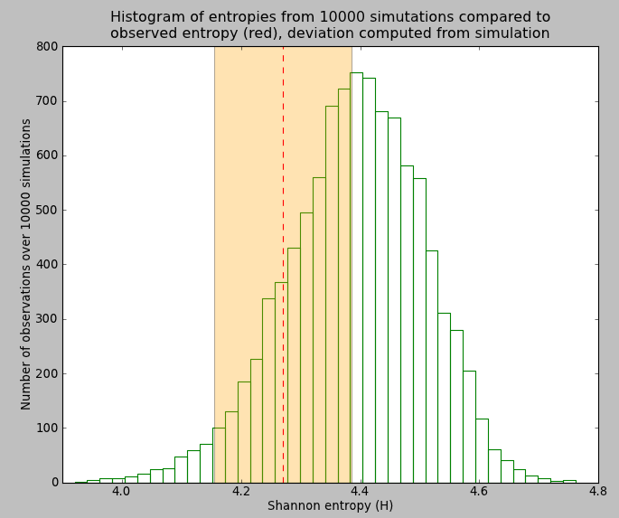

.. moduleauthor:: Francois Serra
.. currentmodule:: ecolopy

Tutorial
********

.. contents::

Just after counting species abundances in an ecosystem
======================================================

Load Community
--------------

Community is a class, and derived objects represent simply a distribution of species abundance , with associated function in order to calculate descriptive statistics or to fit it to evolutionary models.

The data needed to create this object consists on a list of values corresponding to the abundances of each species. We can either give to Community a python list of values:
::

  Community ([1, 4, 4, 12, 54, 68, 32, 15])

or the path to a file containing those values:
::

  Community ('whatever_path/mydata.txt')

mydata.txt would contain the same list of values, one per row:

::

  1
  4
  4
  12
  54
  68
  32
  15

In the next step we are going to create an object :func:`ecolopy_dev.community.Community` that will represent the distribution of abundances of the well known/studied BCI dataset.

We are going to load this object under the name 'com':

::

  from ecolopy import Community
  com = Community ('bci_full.txt')

Quick descriptive statistics
----------------------------

In order to see quickly how does this community looks like, we can use the print command:

::

  print com

output:

.. code-block:: text

  Community (object)
      Number of individuals (J) : 21457
      Number of species (S)     : 225
      Shannon entropy (shannon) : 4.2704
      Metacommunity size (j_tot): 64371
      Models computed           : 
      Model loaded              : None
 
With:

* Number of individuals correspond to the total of the given community
* Number of species should correspond to the number of element in your input list, or to the number of line in your input file
* Shannon entropy [Shannon1948]_ is computed according to:

.. math::
  :nowrap:

  \begin{eqnarray}
    H(X) = \sum_{0\le i\le n} p(x_i) * log (p(x_i))
  \end{eqnarray}

X being the number of individuals for each species and n the number of species.

* Metacommunity size: correspond to 3 times the community size if not defined by user, we could have write to fix it at a given value instead of default:

::

  com = Community ('bci_full.txt', j_tot=10000000)

* Models computed: :func:`ecolopy_dev.community.Community` can be associated to an Ecological model, the user
  need first to compute them.
* Current Model: once computed, we can associate our community to a given model

RSA curve
^^^^^^^^^

An other way to see quickly how our community looks-like is to print relative species abundance curve (RSA) with :func:`ecolopy_dev.community.Community.rsa_ascii`:

::

  print com.rsa_ascii(pch='o', width=90, height=40)
  """
  (%) Relative
  Communitys

  8.0021 +o
         | 
         | oo
         |   o
  2.6181 +    ooo
         |       o
         |        ooo
  1.0319 +           oo
         |             oo
         |               o
         |                o
         |                 oooo
  0.4067 +                     ooo
         |                        oooo
         |                            oooo
         |                                oo
         |                                  ooo
  0.1603 +                                     oooo
         |                                         ooooo
         |                                              ooooo
         |                                                   o
         |                                                    oooo
  0.0632 +                                                        ooooo
         |                                                             ooo
         |                                                                oo
         |                                                                  oo
         |                                                                    
  0.0249 +                                                                    oooo
         |                                                                        oo
         |                                                                          ooo
         |                                                                             ooooo
         |                                                                                  oooooooo
   1/inf +----+----+----+----+----+----+----+----+----+----+----+----+----+----+----+----+----+----+
         0    12   25   37   50   62   75   87   100  112  125  137  150  162  175  187  200  212  222
  
                                                Species rank                                       
  """

Also, if pylab is installed nicer plot can be generated, through the :func:`ecolopy_dev.community.Community.draw_rsa`:

::

   com.draw_rsa()

.. _rsa-fig:

.. figure:: ../ex_figures/rsa.png
  :scale: 80 %

Fit to ecological model
=======================

Once our distribution of abundances loaded into an Community object, EcoloPy proposes a set of ecological models that we can try to fit to our data.

Ewens model
-----------

As described by Hubbell [Hubbell2001]_ 'Ewens model' uses Ewens sampling formula [Ewens1972]_ in order to explain the distribution and abundances of species.

This model assumes that:

.. math::
  :nowrap:

  \begin{eqnarray}
    I  = \frac{m}{(1 - m) * (J - 1)}
  \end{eqnarray}

we just have to type:

::

  com.fit_model('ewens')

this step is usually very fast. When finished just type, to load this model as our current model:

::

  com.set_current_model('ewens')
  print com

output:

.. code-block:: text

  Community (object)
      Number of individuals (J) : 21457
      Number of species (S)     : 225
      Shannon's index (shannon) : 4.2704
      Metacommunity size (j_tot): 64371
      Models computed           : ewens
      Model loaded              : EwensModel
          I                       : 17.4945806282
          theta                   : 34.9622847952
          m                       : 0.000814705802191
          lnL                     : 318.84864864926203

Etienne model
^^^^^^^^^^^^^

Now we can run an other model like the one proposed by Etienne [Etienne2005]_:

::

  com.fit_model('etienne')
  com.set_current_model('etienne')
  print com

output:

.. code-block:: text

  Getting K(D,A) according to Etienne 2005 formula:
    Getting some stirling numbers...
      1000 of 1717, size: 3145976
    Computing K(D,A) at species 108 out of 108

  Community (object)
      Number of individuals (J) : 21457
      Number of species (S)     : 225
      Shannon's index (shannon) : 4.2704
      Metacommunity size (j_tot): 64371
      Models computed           : ewens, etienne
      Model loaded              : EtienneModel
          I                       : 2211.10111912
          theta                   : 47.6743015824
          m                       : 0.0934250928321
          lnL                     : 308.72540670819615

Best optimization strategy for Etienne model
^^^^^^^^^^^^^^^^^^^^^^^^^^^^^^^^^^^^^^^^^^^^

:func:`ecolopy_dev.community.Community.fit_model` function, when called for Etienne model, allows to define the optimization strategy to use all from Scipy [Jones2001]_ (see scipy.optimize documentation).
The fmin optimization strategy is the one used by default, it is fast, but do not allow to set bounds for 
the values of parameters to optimize, sometimes ending with values of *theta* almost infinite. 

To circumvent this problem, other optimization strategies are available, it is recommended to use several of them.
A simple way to find the best optimization would be:

::

  tmp = {}
  for met in ['fmin', 'slsqp', 'l_bfgs_b', 'tnc']:
      print 'Optimizing with %s...' % met
      try:
          com.fit_model(name='etienne', method=met, verbose=False)
          model = com.get_model('etienne')
          tmp[met] ={}
	  tmp[met]['model'] = model
          tmp[met]['theta'] = model.theta
          tmp[met]['I']     = model.I
          tmp[met]['m']     = model.m
          tmp[met]['lnL']   = model.lnL
      except Exception as e:
          print '    optimization failed: ' + e.args[0]
  
  # in case optimization by fmin failed to found correct values for theta and m:
  if not (1 <= tmp['fmin']['theta'] < com.S and \
          1e-50 <= tmp['fmin']['m'] < 1-1e-50):
      del (tmp['fmin'])
  
  # find the model with the higher likelihood:
  met = min(tmp, key=lambda x: tmp[x]['lnL'])
  
  # load it as 'etienne' model
  com.set_model(tmp[met]['model'])

*Also it is a good thing to try different starting values for optimization, by default* :func:`ecolopy_dev.community.Community.fit_model` *will use the number of species for theta and 0.5 for m (for the full doc see* :func:`ecolopy_dev.models.etienne_model.EtienneModel.optimize` *, the funticon called internally by fit_model)*

Generate contour image of likelihood
^^^^^^^^^^^^^^^^^^^^^^^^^^^^^^^^^^^^
 
.. _contour-fig:

.. figure:: ../ex_figures/contour_lnl.png
  :scale: 55 %

  Contour plots representing log likelihood values of BCI dataset fitting Etienne  model with different values of *theta* and *m*. Global optima computed by the optimization is found here at the intersection of dashed lines, while local optima are marked by white crosses (7 of them are found, including global optima).

In the case of Etienne model EcoloPy allow user to draw contour frame of likelihood :num:`Figure #contour-fig` (:func:`ecolopy_dev.utils.draw_contour_likelihood`).

::

  from ecolopy.utils import draw_contour_likelihood
  # this can take 2 or 3 hours to compute
  draw_contour_likelihood(com, theta_range=[20,100], m_range=[0.05, 0.8], num_dots=100)

Log-normal model
----------------

In EcoloPy is also implemented log normal model:

::

  com.fit_model('lognormal')
  com.set_current_model ('lognormal')

  print com

output: 

.. code-block:: text

  Community (object)
      Number of individuals (J) : 4219
      Number of species (S)     : 162
      Shannon's index (shannon) : 4.5938
      Metacommunity size (j_tot): 12657
      Models computed           : lognormal, ewens, etienne
      Model loaded              : LognormalModel
          mu                      : 3.14269458985
          sd                      : 1.78719175872
          lnL                     : None
        
*Note: As likelihood value of log-normal model is not comparable to the one of Etienne or Ewens models, it is not calculated.*

Comparing Models
================

Browsing parameters
-------------------

Now we have fit our community to some models, a summary of the corresponding parameters are available through the print function, but each of them can also be reach like this:

::

  com.set_current_model('ewens')
  com.theta
  com.m
  com.I
  com.lnL

output: 

.. code-block:: text

  34.962254203932339
  0.00081470508933989701
  17.494565308269266
  318.84864864917472

or you can get any attribute through the model linked to our community:

::

  model = com.get_model('ewens')
  model.lnL

output: 

.. code-block:: text

  318.84864864917472

*All these values correspond to the current model (in this case ewens).*

Searching for best model
------------------------

We have run now several models, within which the nested models ewens and etienne, for those we can run a likelihood ratio test using the lrt function.

This function will compute a chi square test for 2 times the difference in likelihoods, with one degree of freedom (corresponding to the estimation of parameter *m*):

::

  print com.lrt ('ewens', 'etienne')

output:

.. code-block:: text

  6.80784682569e-06

Generate random distribution
============================

In order to compare our distribution of abundances to the expected one according to a specific model, we can generate random neutral distributions.
By default EcoloPy will use the parameters of the current model but this can be change passing to the function the name of the wanted model:

::

  com.generate_random_neutral_distribution(model='etienne')

output:

.. code-block:: text

  [17.0, 867.0, 397.0, 184.0, 71.0, 
  ...
  ...
  2.0, 2.0, 1.0, 1.0, 1.0, 1.0]

Testing for neutrality
======================

Getting significance of deviation from neutrality
-------------------------------------------------

In order to test if our distribution of abundances is neutral, Ecolopy implements a test based on comparing the distribution of values of Shannon entropies compared to the observed one (:func:`ecolopy_dev.community.Community.test_neutrality`).

::

  # call test_neutrality function with the full option, making it to return the list
  # of simulated entropies (WARNING: this number of generations is large... 
  # it will take a while)
  pval, neut_h = com.test_neutrality(model='etienne', gens=10000, full=True)
  print pval

output:

.. code-block:: text

  0.1492

According to this p-value, we would conclude that our dataset do not deviates significantly from neutrality.

Variations:
^^^^^^^^^^^
* **more restrictive** test can be done by fixing the number of species (S) to the observed number. For our example S-fixed would fix it to 225, and the result of such test would be:

::

  print com.test_neutrality(model='etienne', gens=10000, fix_s=True)

output:

.. code-block:: text

  0.0977

* another test can also be conducted through the same function, based on the **comparison of likelihoods** instead of Shannon's index [Etienne2007]_

::

  print com.test_neutrality(model='etienne', gens=1000,method='loglike', verbose=True)

output (this time, we set the verbose option, in order to follow the progression of the generation of random neutral community):

.. code-block:: text

  Generating random neutral abundances 1000 out of 1000
  0.353

Plotting distribution of simulations:
-------------------------------------

We can also draw the distribution of simulated entropies and visually compare them to the observed value :num:`Figure #shannon-hist` (:func:`ecolopy_dev.utils.draw_shannon_distrib`).

::

  # using previously generated neut_h
  draw_shannon_distrib(neut_h, com.shannon)

.. _shannon-hist:

  Histogram of distribution of shannon entropy values after 10.000 simulation under neutral model Etienne. 
  Red vertical bar represents the observed value of entropy for our dataset, and the orange shade, 
  the corresponding deviation inferred from simulation.

Saving/Loading Community object
===============================

Once done EcoloPy allow user to save Community object and EcologicalModels object into cPikle with :func:`ecolopy_dev.community.Community.dump_community` and :func:`ecolopy_dev.community.Community.load_community` functions.

::

  # save it
  com.dump_community('stored_bci.pik')
  # (re)load it
  com = Community('stored_bci.pik')

References
==========

.. [Etienne2005] Rampal S Etienne, A new sampling formula for neutral biodiversity. Ecology Letters 8(3) (2005), 253-260.

.. [Etienne2007] Rampal S Etienne, A neutral sampling formula for multiple samples and an ’exact’ test of neutrality. Ecology letters 10(7) (2007), 608-18.

.. [Ewens1972] Waren J Ewens, The sampling theory of selectively neutral alleles. Theoretical population biology 3(1) (1972), 87-112.

.. [Hubbell2001] Stephen P Hubbell, The unified Neutral Theory of Biodiversity and Biogeography. Princeton University Press, 2001.

.. [Jones2001] Eric Jones, Travis Oliphant, Pearu Peterson, and Others, Scipy: Open source scientific tools for Python, 2001.

.. [Shannon1948] C E Shannon, A mathematical theory of communication, vol. 5. The Bell System Technical Journal, 1948.
